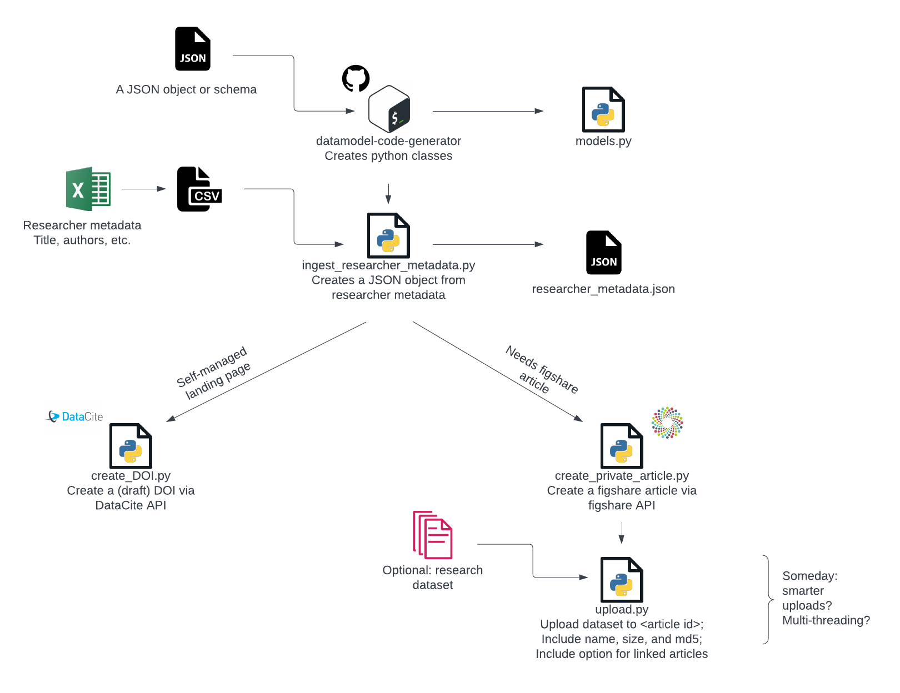

A nascent effort to develop some simple scripts for interacting with the figshare and/or DataCite APIs. 

I am looking to https://github.com/dandi/dandi-schema for design inspiration. 

My first goal is a workflow for programmatic creation of figshare articles. Here is the plan:

