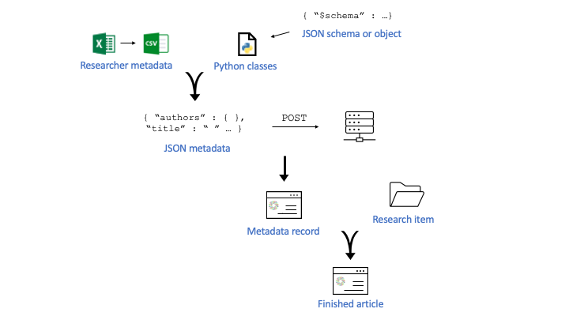

# figleaf
Here are some simple scripts for interacting with the figshare APIs. Right now, the goal is to be able to create many figshare articles automatically in batches. Currently, all it can do is create a new article and upload data to that article, in a one-by-one, interactive way. I also started working on creating DOIs with metadata through the DataCite API, but that effort has been shelved for the moment.

The basic approach is as follows: I'm ingesting the researcher's metadata from an excel spreadsheet, then converting that to a JSON document. I asked ChatGPT to create a JSONSchema for fisghare's new article uploads. Then I'm using [datamodel-code-generator](https://koxudaxi.github.io/datamodel-code-generator/) and [Pydantic](https://docs.pydantic.dev/latest/) to validate that the researcher's metadata is compliant with that schema. Then I POST the validated JSON document to figshare's server, and then I upload the data file(s).

Currently, I'm only supporting a handful of metadata fields. 

Here's a graphical summary of the workflow:

___

#### Workflow #1: Create figshare articles in batches
Before you can programmatically create a figshare article, you need two things: the metadata for the article, (authors, title, etc.) in a web-ready format (JSON); and you need a schema against which to validate those metadata, to make sure they're good to go.

I created the schema first, by taking the essential metadata fields from the figshare metadata overview, [here](https://help.figshare.com/article/figshare-metadata-schema-overview), and figshare's API docs, [here](https://docs.figshare.com/#private_article_create). See figleaf/READMEmodels.txt. To be able to work with this schema in python, you need to create some generic python classes (pydantic calls these "models") from the JSON schema objects. You'll wrangle the researcher metadata into instances of these python classes. 
I call the file containing these classes (models) priv_article_models.py. I created it by running datamodel-code-generator on the figshare private article JSON schema.
That command went something like this:
datamodel-codegen --input private_article_schema.json --input-file-type jsonschema --output priv_article_models.py

Before we can create a JSON document with metadata for the experiment, there are certain metadata fields we can only fill out by querying the figshare server. These are authors, categories, and keywords. We have to use figshare's numerical codes for the categories and keywords we want. I do this with my script `get_figshare_info.py`. For usage instructions, run that script with the `-h` flag.

Next, I combine the researcher's metadata and figshare's numerical codes into a **very** carefully formatted excel sheet, which I export "Save As" to csv. Finally, I convert the csv to JSON (with compatibility checking) with `ingest_researcher_metadata.py`. 

Next, `create_and_publish.py` POSTs a private article with metadata to figshare's server, and gives the user the option to add a DOI, add one or more data files, and publish (that is, make the private article public,) right away. 

Finally, `publish_existing.py` gives the user the option to PUT a file on figshare associated with that article. The user must know the article id to do this. create_and_publish.py prints the article id when the private article is created, so that's the easiest way to get the article id. You can also do something like this: `curl -X GET https://api.figsh.com/v2/account/articles -H "Authorization: token <mytoken>"` to quickly see all your articles. 

___
#### Workflow #2: Create DOIs directly through DataCite
Not yet up and running.

