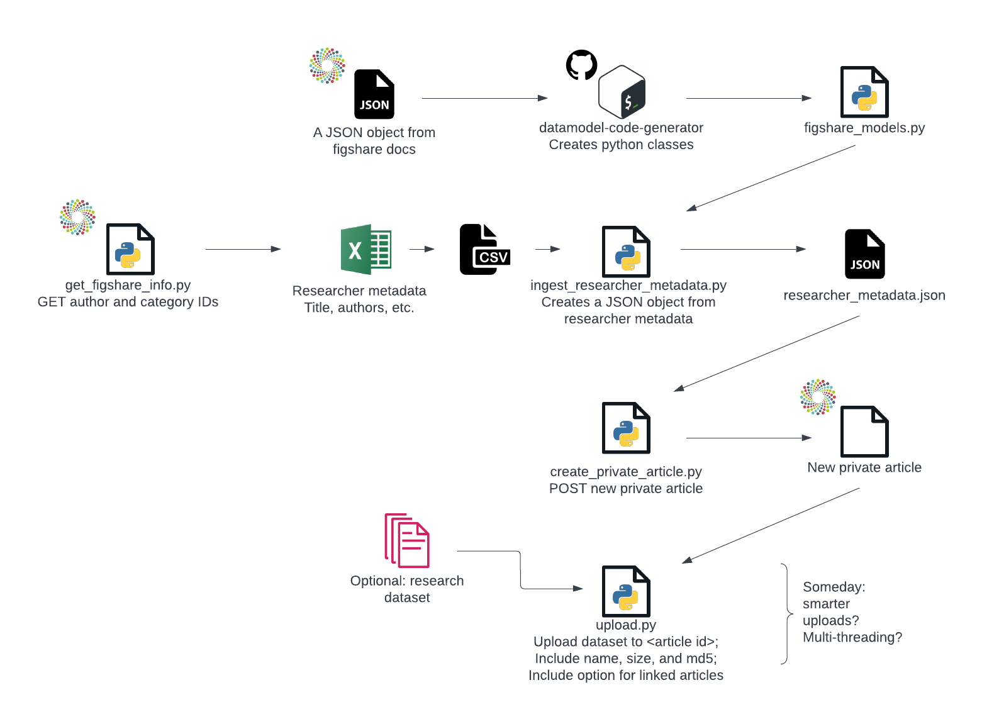

Here is my plan for programmatic creation of figshare articles. 

Note that there is no figshare schema. Instructions to create one are in figleaf/create_models.readme, but there are several caveats. For one, the schema you need for creating a private article is not the same as the schema you get from querying an existing public article. Another caveat is that there's no good way to tell datamodel-code-generator which fields are mandatory and which are optional. See create_models.readme for more info.

